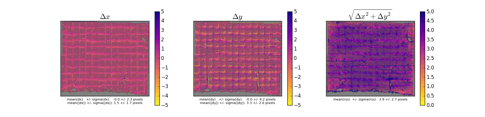
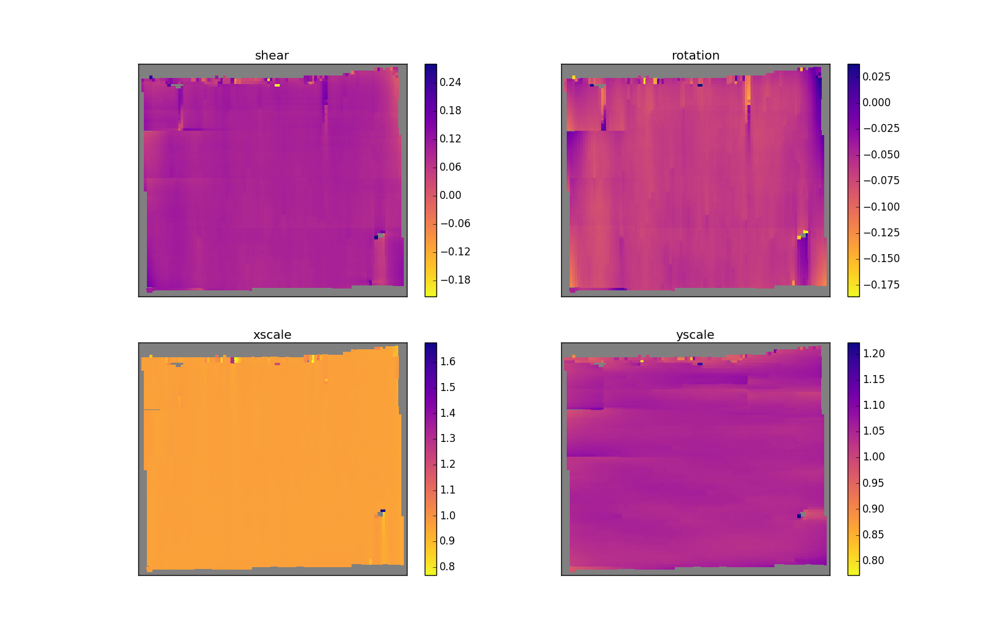

# quality control
## look at what comes into and goes out of the solver

modified so that it uses the same argschema and json inputs as the solver.

### pointmatch map

usage:
```
EM_aligner_python >ipython

In [1]: %pylab
In [2]: import EMaligner.qctools.CheckPointMatches as cpm
In [3]: f = cpm.CheckPointMatches(args=["--input_json","path/to/this.json"])
In [4]: f.run(1241,1241)

```
I run the magic %pylab command to make sure interactive plotting works. Maybe you have a better way.

The arguments to f.run() are the two z values between which you'd like to map the point matches.

Makes a plot and saves a pdf.


### residual map

usage:
```
EM_aligner_python >ipython

In [1]: %pylab
In [2]: import EMaligner.qctools.CheckResiduals as cr
In [3]: f = cr.CheckResiduals(args=["--input_json","path/to/this.json"])
In [4]: f.run(1241,1241,thr=5)

```
This function operates on the output_stack. When using a solve json, it assumes the solve has run and ingested. If that's not the intent, user needs to pass some different args in.

thr sets a color threshold for the plots

Makes a plot and saves a pdf.



### transform maps


usage:
```
EM_aligner_python >ipython

In [1]: %pylab
In [2]: import EMaligner.qctools.CheckTransforms as ct
In [3]: f = ct.CheckTransforms(args=["--input_json","path/to/this.json"])
In [4]: f.run(1241)

```
Makes a plot and saves a pdf.


