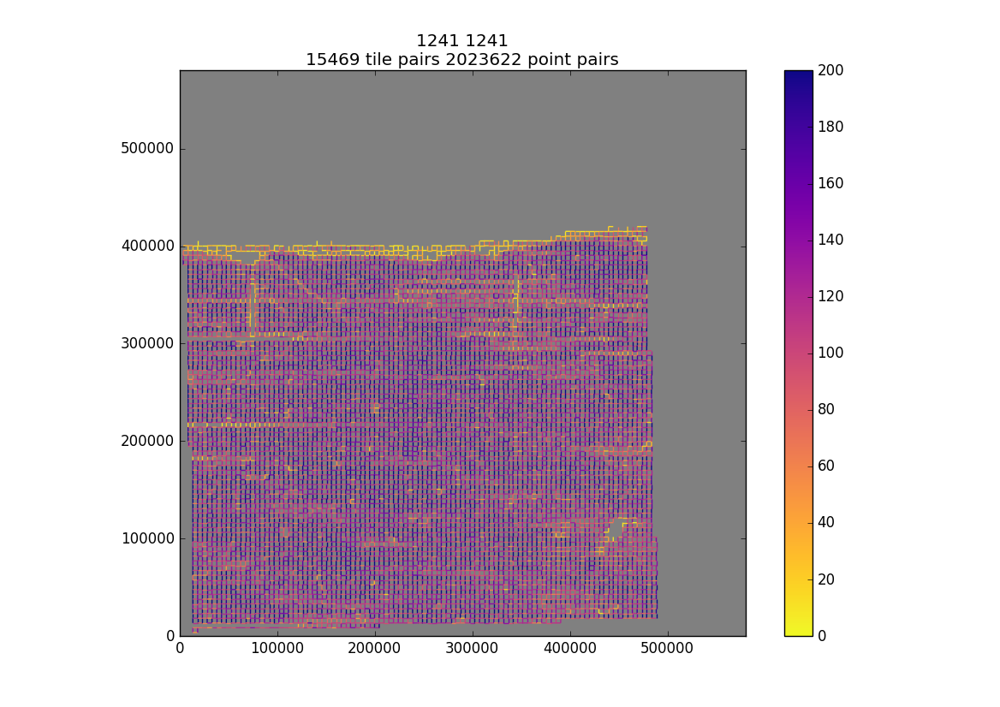

# quality control
## look at what comes in and goes out of the solver

modified so that it uses the same argschema and json inputs as the solver.

### pointmatch map

usage:
```
EM_aligner_python >ipython

In [1]: %pylab
In [2]: import EMaligner.qctools.CheckPointMatches as cpm
In [3]: f = cpm.CheckPointMatches(args=["--input_json","path/to/this.json"])
In [4]: f.run(1241,1241)

```
I run the magic %pylab command to make sure interactive plotting works. Maybe you have a better way.

The arguments to f.run() are the two z values between which you'd like to map the point matches.

Makes a plot and saves a pdf.


### residual map

... coming soon
